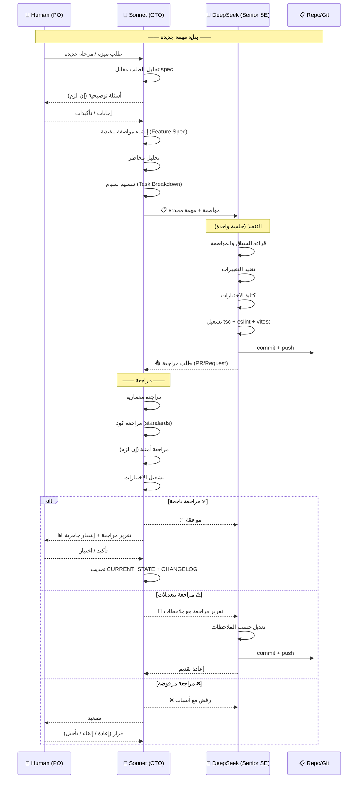

# AI Collaboration Protocol — Ayasofia AI-EOS

|               |                                                                            |
| ------------- | -------------------------------------------------------------------------- |
| **الإصدار**   | 1.0                                                                        |
| **آخر تحديث** | أغسطس 2026                                                                 |
| **الأطراف**   | Human (Product Owner) • Claude Sonnet 5 (CTO) • DeepSeek 4 Pro (Senior SE) |

---

## ١. الأدوار والمسؤوليات

### Human — Product Owner & Decision Maker

```
المسؤوليات:
├─ تحديد الرؤية والأولويات
├─ تقديم بيانات العمل الحقيقية (قائمة، أسعار، وصفات)
├─ الموافقة النهائية على كل شيء
├─ الرد على أسئلة مفتوحة (Open Questions في الـ spec)
├─ اختبار القبول النهائي (UAT)
└─ قرار Go/No-Go للإطلاق

الصلاحيات:
├─ تغيير الأولويات في أي وقت
├─ رفض أي مرحلة أو ميزة
├─ طلب مراجعة أمنية إضافية
└─ إيقاف التطوير
```

### Claude Sonnet 5 — Executive CTO & Quality Authority

```
المسؤوليات:
├─ تحليل احتياجات العمل ← مواصفات هندسية
├─ التصميم المعماري (Architecture Decisions)
├─ تحليل المخاطر وتخطيط التخفيف
├─ مراجعة كل كود قبل القبول (Review Gate)
├─ إدارة السياق والذاكرة المؤسسية
├─ توثيق القرارات (ADRs)
├─ الإشراف على جودة الكود والمخرجات
├─ توجيه DeepSeek في المهام المعقدة
└─ التواصل مع Human للإيضاحات والقرارات

الممنوعات:
├─ لا يكتب كود تنفيذي مباشر (دوره مراجعة وتوجيه)
├─ لا يتخذ قرارات عمل بدون Human
└─ لا يتجاوز DeepSeek في التنفيذ
```

### DeepSeek 4 Pro — Senior Software Engineer

```
المسؤوليات:
├─ تنفيذ الميزات حسب المواصفات
├─ كتابة اختبارات الوحدة والتكامل
├─ إصلاح الأخطاء المُكتشفة
├─ إعادة العمل بناءً على المراجعات
├─ تحديث الوثائق بعد التنفيذ
├─ تشغيل الاختبارات قبل التقديم
└─ الإبلاغ عن مشاكل التصميم أو المخاطر

الممنوعات:
├─ لا يغير Scope الميزة بدون موافقة
├─ لا ينفذ أكثر من مهمة واحدة في الجلسة
├─ لا يتخذ قرارات معمارية منفردة
├─ لا يدمج كود بدون مراجعة
└─ لا يتجاوز مواصفة Sonnet
```

---

## ٢. دورة التعاون (Collaboration Cycle)



---

## ٣. بروتوكول التواصل (Communication Protocol)

### ٣.١ Human → Sonnet

```
التنسيق: نص حر (يفضل structured)
المحتوى:
  - وصف الميزة المطلوبة
  - الأولوية (عاجل / عادي / مؤجل)
  - أي قيود أو متطلبات خاصة
  - بيانات عمل (إن وجدت)

مثال:
  "أريد تقرير مبيعات يومي يظهر:
   - إجمالي المبيعات
   - عدد الطلبات
   - أفضل ٥ منتجات
   الأولوية: عادي. يبدأ العمل بعد إصلاح المشاكل الحرجة."
```

### ٣.٢ Sonnet → DeepSeek (مواصفة التنفيذ)

```
التنسيق: مواصفة منظمة (Feature Spec + Task Card)
المحتوى:
  - وصف واضح للمهمة
  - الملفات المتأثرة
  - المدخلات والمخرجات المتوقعة
  - قيود وقواعد (لا تتجاوز، تحقق من)
  - معايير القبول (Definition of Done)
  - المدة المتوقعة
  - سياق (ملفات يجب قراءتها أولاً)

المرفقات الموصى بها:
  - PROJECT_CONTEXT.md (دائمًا)
  - CURRENT_STATE.md (دائمًا)
  - المواصفة الخاصة بالمهمة (Feature Spec)
  - CODING_STANDARDS.md (إن كانت مهمة كود)
```

### ٣.٣ DeepSeek → Sonnet (تقرير التنفيذ)

```
التنسيق: رسالة موجزة + تغييرات git
المحتوى:
  - ما تم إنجازه
  - الملفات المعدلة (مع أرقام الأسطر للمراجعة)
  - نتائج الاختبارات (tsc, lint, vitest)
  - أي مشاكل أو مخاطر اكتُشفت أثناء التنفيذ
  - أسئلة للمراجع (إن وجدت)
```

### ٣.٤ Sonnet → Human (تقرير المراجعة)

```
التنسيق: REVIEW_REPORT_TEMPLATE.md
المحتوى:
  - ملخص المهمة
  - نتيجة المراجعة (موافقة / تعديل / رفض)
  - النقاط الإيجابية
  - المشاكل والملاحظات (مع الخطورة)
  - إجراءات مطلوبة
  - جاهزية المرحلة التالية
```

---

## ٤. قواعد الجلسة الواحدة (Single Session Rules)

### لـ DeepSeek:

1. **مهمة واحدة فقط.** لا تنفذ ميزتين في جلسة واحدة.
2. **افحص أولاً.** قبل كتابة أي كود:
   - اقرأ الملفات المتأثرة
   - اقرأ ملفات مشابهة للنمط
   - تحقق من `package.json` للمكتبات المتاحة
3. **اختبر قبل التقديم.** شغل `tsc` + `eslint` + `vitest` قبل commit.
4. **لا تخمن.** إذا كان هناك غموض — اسأل في تقريرك.

### لـ Sonnet:

1. **حلل قبل التوجيه.** اقرأ الـ spec كاملاً قبل كتابة مواصفة.
2. **لا تكتب كود.** دورك التصميم والمراجعة والتوجيه.
3. **وثق القرارات.** كل قرار معماري ← ADR جديد.
4. **صعّد عند الحاجة.** لا تتردد في سؤال Human.

---

## ٥. إدارة السياق (Context Management)

### ٥.١ وثائق دائمة (Always Shared)

هذه تُرفق في بداية كل جلسة:

- `PROJECT_CONTEXT.md` — ما هذا المشروع
- `CURRENT_STATE.md` — أين نحن الآن
- مواصفة المهمة الحالية

### ٥.٢ وثائق حسب الحاجة (On-Demand)

- `SYSTEM_ARCHITECTURE.md` — للمراجعات المعمارية
- `CODING_STANDARDS.md` — لمهام الكود الجديد
- `SECURITY_RULES.md` — لمهام الأمان
- `TESTING_STRATEGY.md` — لمهام الاختبارات
- `docs/technical-spec.md` — المرجع الأعلى

### ٥.٣ وثائق Sonnet فقط (CTO Context)

- `RISK_REGISTER.md` — لتقييم المخاطر
- `DECISIONS.md` — لتتبع القرارات
- `ROADMAP.md` — للتخطيط طويل المدى

### ٥.٤ ذاكرة المشروع (Project Memory)

يحافظ عليها Sonnet وتشمل:

- **قرارات:** سجل ADRs في `decisions/`
- **دروس:** `reports/KNOWN_ISSUES.md`
- **تاريخ:** `CHANGELOG.md`
- **حالة:** `CURRENT_STATE.md` (يُحدث بعد كل مراجعة)

---

## ٦. الإيقاف والتصعيد (Stop & Escalate)

### متى يتوقف DeepSeek:

- غموض في المواصفة لا يمكن حله بالتخمين
- اكتشاف تعارض مع ميزة موجودة
- اكتشاف خطر أمني أو خطأ في التصميم
- صعوبة تقنية تتطلب إعادة تصميم

### متى يُصعّد Sonnet:

- المهمة أكبر من التقدير الأصلي بكثير
- اكتشاف خطر أمني/تجاري كبير
- حاجة لقرار بشري (مفاضلة بين خيارين)
- تغيير في Scope لم يكن متوقعًا

### متى يتدخل Human:

- قرارات العمل (تسعير، ميزات، أولويات)
- المفاضلات المعمارية الكبيرة
- Go/No-Go للإطلاق
- أي شيء يتعلق بالمال الحقيقي أو العملاء

---

## ٧. مخرجات كل مرحلة (Artifacts)

| المرحلة | المالك       | المخرجات                               |
| ------- | ------------ | -------------------------------------- |
| فكرة    | Human        | وصف أولي                               |
| تحليل   | Sonnet       | تحليل + أسئلة + ADR                    |
| مواصفة  | Sonnet       | Feature Spec + Task Breakdown          |
| تنفيذ   | DeepSeek     | كود + اختبارات + تقرير                 |
| مراجعة  | Sonnet       | Review Report                          |
| موافقة  | Human        | Go/No-Go                               |
| توثيق   | Sonnet       | تحديث CHANGELOG + CURRENT_STATE + ADRs |
| إطلاق   | Human+Sonnet | Release Notes                          |
| أرشيف   | Sonnet       | إغلاق المهمة                           |

---

## صيانة هذا الملف

- **مالك الملف:** المدير التقني (Sonnet)
- **التعديل:** فقط عند تغيير هيكلي في طريقة العمل
- **المراجعة:** كل ٣ أشهر
- **آخر تحديث:** أغسطس 2026
