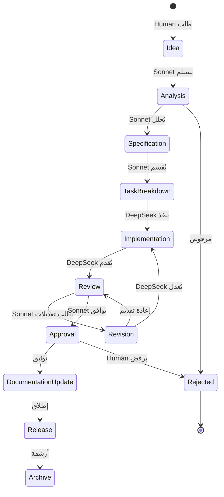

# Task Lifecycle — Ayasofia AI-EOS

|               |            |
| ------------- | ---------- |
| **الإصدار**   | 1.0        |
| **آخر تحديث** | أغسطس 2026 |

---

## دورة حياة المهمة الكاملة



---

## تفاصيل كل مرحلة

### ١. Idea (فكرة)

```
المالك: Human
المدخلات: وصف أولي للميزة أو الطلب
المخرجات: طلب مكتوب (رسمي أو غير رسمي)
المعايير: فكرة واضحة بما يكفي للتحليل
```

**مثال:**

> "أريد تقرير مبيعات يومي يظهر إجمالي المبيعات وأفضل ٥ منتجات."

---

### ٢. Analysis (تحليل)

```
المالك: Sonnet
المدخلات: طلب Human
الأنشطة:
  - قراءة spec (docs/technical-spec.md)
  - مراجعة CURRENT_STATE.md
  - فحص الكود الحالي (grep/read للكيانات المعنية)
  - تحديد التأثير (ما الجداول، الـ actions، المكونات المتأثرة)
  - تحديد المخاطر
  - كتابة أسئلة توضيحية لـ Human إن لزم الأمر
المخرجات: تقرير تحليل + أسئلة (إن وجدت)
المستندات المطلوبة: PROJECT_CONTEXT.md, CURRENT_STATE.md, technical-spec.md
```

---

### ٣. Specification (مواصفة)

```
المالك: Sonnet
المدخلات: تقرير التحليل + ردود Human
الأنشطة:
  - كتابة Feature Spec كاملة (انظر FEATURE_SPEC_TEMPLATE.md)
  - تعريف: المدخلات، المعالجة، المخرجات
  - تعريف: الملفات الجديدة والمعدلة
  - تعريف: الجداول، الـ actions، المكونات
  - تعريف: معايير القبول (DoD)
  - تعريف: الاختبارات المطلوبة
المخرجات: FEATURE_SPEC-XXXX.md في specifications/
المستندات المطلوبة: FEATURE_SPEC_TEMPLATE.md
```

---

### ٤. Task Breakdown (تقسيم المهام)

```
المالك: Sonnet
المدخلات: Feature Spec
الأنشطة:
  - تقسيم المواصفة إلى مهام مستقلة
  - ترتيب المهام حسب التبعية
  - تقدير الجهد لكل مهمة
  - كتابة Task Cards
المخرجات: TASK-XXXX.md (واحد أو أكثر) في tasks/
المستندات المطلوبة: TASK_TEMPLATE.md
```

---

### ٥. Implementation (تنفيذ)

```
المالك: DeepSeek
المدخلات: Task Card + Feature Spec
الأنشطة:
  1. قراءة السياق (PROJECT_CONTEXT, CURRENT_STATE)
  2. قراءة المواصفة كاملة
  3. قراءة الملفات المتأثرة (لفهم النمط)
  4. كتابة الكود
  5. كتابة الاختبارات
  6. تشغيل tsc --noEmit (يجب أن يمر)
  7. تشغيل npm run lint (يجب أن يمر)
  8. تشغيل npm run test (يجب أن يمر)
  9. كتابة تقرير تنفيذي موجز
  10. Commit + Push
المخرجات: كود + اختبارات + تقرير
ضوابط الجودة:
  - CODING_STANDARDS.md (إلزامي)
  - لا parseFloat على أسعار
  - لا تجاوز لـ requireStaffSession
  - idempotencyKey في كل كتابة
```

---

### ٦. Review (مراجعة)

```
المالك: Sonnet
المدخلات: كود DeepSeek + تقريره
الأنشطة:
  - مراجعة معمارية (هل التصميم سليم؟)
  - مراجعة كود (CODING_STANDARDS، الأنماط، الأخطاء)
  - مراجعة أمنية (إن كان التغيير يمس auth/money/inventory)
  - تشغيل الاختبارات
  - التحقق من معايير القبول (DoD)
  - كتابة Review Report
النتائج الممكنة:
  ✅ موافقة — ينتقل إلى Approval
  ⚠️ تعديلات مطلوبة — ينتقل إلى Revision
  ❌ مرفوض — ينتقل إلى Human للتصعيد
المستندات المطلوبة: REVIEW_REPORT_TEMPLATE.md
```

---

### ٧. Revision (تعديل)

```
المالك: DeepSeek
المدخلات: Review Report (ملاحظات Sonnet)
الأنشطة:
  - قراءة الملاحظات
  - تعديل الكود حسب المطلوب
  - إعادة تشغيل الاختبارات
  - إعادة تقديم
المخرجات: كود معدل
ملاحظة: يُعاد تقديم المهمة إلى Review
```

---

### ٨. Approval (موافقة)

```
المالك: Human (أخيرًا) + Sonnet (تقنيًا)
المدخلات: Review Report إيجابي
الأنشطة:
  - Human يراجع الميزة (إن كانت مرئية)
  - Sonnet يمنح الموافقة التقنية النهائية
  - دمج الكود في الفرع الرئيسي
المخرجات: كود مدمج
```

---

### ٩. Documentation Update (تحديث الوثائق)

```
المالك: Sonnet
المدخلات: المهمة المكتملة
الأنشطة:
  - تحديث CURRENT_STATE.md
  - تحديث ROADMAP.md (تعليم المهمة كمكتملة)
  - تحديث CHANGELOG.md
  - تحديث DECISIONS.md (إن كانت هناك قرارات جديدة)
  - أرشفة التقارير
المخرجات: وثائق محدثة
```

---

### ١٠. Release (إطلاق)

```
المالك: Human + Sonnet
المدخلات: مجموعة من المهام المكتملة
الأنشطة:
  - اختبار شامل على بيئة staging
  - كتابة Release Notes
  - نشر على Vercel
  - مراقبة Sentry لمدة ٢٤ ساعة
المخرجات: إصدار منشور + RELEASE-XXXX.md
```

---

### ١١. Archive (أرشفة)

```
المالك: Sonnet
المدخلات: مهمة مكتملة منذ فترة
الأنشطة:
  - نقل Task Cards المكتملة إلى archive/
  - الاحتفاظ بالـ ADRs و Feature Specs للأبد
المخرجات: أرشيف مرتب
```

---

## مصفوفة RACI

| النشاط         | Human | Sonnet | DeepSeek |
| -------------- | ----- | ------ | -------- |
| Idea           | **R** | I      | —        |
| Analysis       | C     | **R**  | —        |
| Specification  | A     | **R**  | —        |
| Task Breakdown | I     | **R**  | —        |
| Implementation | —     | A      | **R**    |
| Review         | I     | **R**  | C        |
| Revision       | —     | A      | **R**    |
| Approval       | **R** | A      | I        |
| Doc Update     | I     | **R**  | —        |
| Release        | **R** | A      | —        |

> R = Responsible (منفذ) | A = Accountable (مسؤول) | C = Consulted (مُستشار) | I = Informed (مُبلغ)

---

## صيانة هذا الملف

- **مالك الملف:** المدير التقني (Sonnet)
- **دورة المراجعة:** كل ٦ أشهر
- **آخر تحديث:** أغسطس 2026
